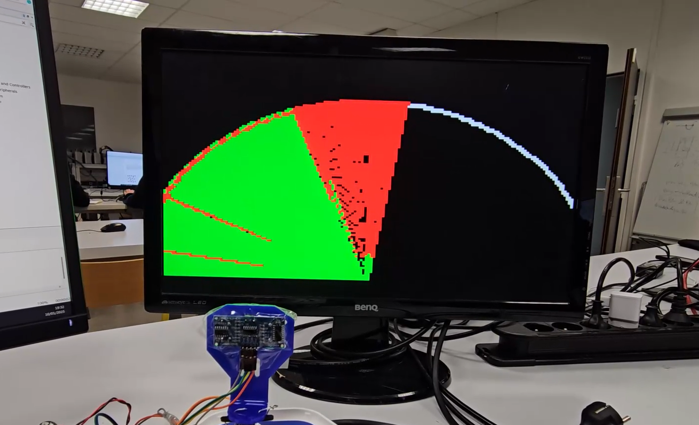
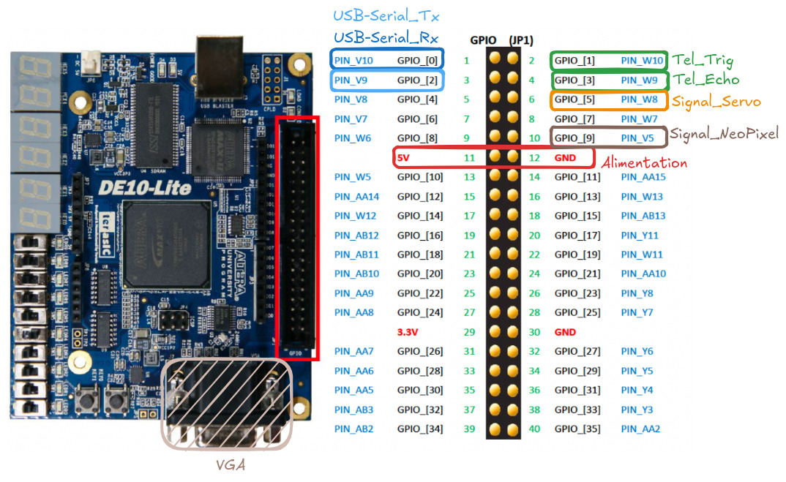

# FPGA-Ultrasonic-2D-Radar
Ce projet utilise un FPGA pour créer un radar 2D à ultrasons. Le système utilise des capteurs à ultrasons pour détecter des objets et afficher leur position sur une interface graphique. En ajoutant un moniteur VGA, il est possible de voir où se trouvent les objets, de se connecter via UART à un ordinateur, de recevoir et de traiter ces données, ainsi que de voir la progression de la cartographie sur un ensemble de LED NeoPixel. Pour illustrer son fonctionnement, vous pouvez consulter le rapport joint au projet ainsi que la vidéo suivante : [Demonstration](https://etusorbonneuniversitefr-my.sharepoint.com/personal/daniel_ferreira_lara_etu_sorbonne-universite_fr/_layouts/15/stream.aspx?id=%2Fpersonal%2Fdaniel%5Fferreira%5Flara%5Fetu%5Fsorbonne%2Duniversite%5Ffr%2FDocuments%2F2024%2E2%2FUE4%5FArchitecture%5Fdes%5FSEs%2FProjet%2Fdemo%2Emp4&nav=eyJyZWZlcnJhbEluZm8iOnsicmVmZXJyYWxBcHAiOiJPbmVEcml2ZUZvckJ1c2luZXNzIiwicmVmZXJyYWxBcHBQbGF0Zm9ybSI6IldlYiIsInJlZmVycmFsTW9kZSI6InZpZXciLCJyZWZlcnJhbFZpZXciOiJNeUZpbGVzTGlua0NvcHkifX0&ga=1&referrer=StreamWebApp%2EWeb&referrerScenario=AddressBarCopied%2Eview%2E716ff8df%2D2623%2D480a%2Da631%2D428f6beeff6d)


<div align="center">
    <a href="https://etusorbonneuniversitefr-my.sharepoint.com/personal/daniel_ferreira_lara_etu_sorbonne-universite_fr/_layouts/15/stream.aspx?id=%2Fpersonal%2Fdaniel%5Fferreira%5Flara%5Fetu%5Fsorbonne%2Duniversite%5Ffr%2FDocuments%2F2024%2E2%2FUE4%5FArchitecture%5Fdes%5FSEs%2FProjet%2Fdemo%2Emp4&nav=eyJyZWZlcnJhbEluZm8iOnsicmVmZXJyYWxBcHAiOiJPbmVEcml2ZUZvckJ1c2luZXNzIiwicmVmZXJyYWxBcHBQbGF0Zm9ybSI6IldlYiIsInJlZmVycmFsTW9kZSI6InZpZXciLCJyZWZlcnJhbFZpZXciOiJNeUZpbGVzTGlua0NvcHkifX0&ga=1&referrer=StreamWebApp%2EWeb&referrerScenario=AddressBarCopied%2Eview%2E716ff8df%2D2623%2D480a%2Da631%2D428f6beeff6d">
        
    </a>
</div>

## Prérequis
- [FPGA DE10-Lite](https://ftp.intel.com/Public/Pub/fpgaup/pub/Intel_Material/Boards/DE10-Lite/DE10_Lite_User_Manual.pdf)
- [Capteurs à ultrasons](http://www.robot-maker.com/shop/img/cms/datasheet-capteur-ultrasons-hc-sr04.pdf)
- [Quartus 18.1](https://www.intel.com/content/www/us/en/software-kit/665990/intel-quartus-prime-lite-edition-design-software-version-18-1-for-windows.html)
- [Servomoteur MG90s](https://www.electronicoscaldas.com/datasheet/MG90S_Tower-Pro.pdf?srsltid=AfmBOoooWaZS4cdqvNMc-iUB114IEgXXqL5ZEZMro7B5KP26gQqPS6rS)
- Convertisseur Serial-USB
- Écran VGA
- [NeoPixel 12 LEDS](https://static6.arrow.com/aropdfconversion/1199f143d03307f0838608ccd06dcf59829760b/pgurl_5139579995243200.pdf)
- Câbles de connexion
- Ordinateur avec un port USB

## Installation
### Firmware
1. Clonez le dépôt du projet :
    ```sh
    git clone https://github.com/votre-utilisateur/FPGA-Ultrasonic-2D-Radar.git
    cd FPGA-Ultrasonic-2D-Radar/
    ```
2. Ouvrez le logiciel Quartus 18.1 et connectez le FPGA à l'ordinateur.
3. Ouvrez le projet `DE10_Lite_computer_YD/DE10_Lite_Computer.qpf` dans Quartus.
4. **(Optionnel)** Compilez le projet pour générer le fichier binaire pour le FPGA.
5. Ouvrez le menu `Tools/Programmer` et programmez le DE10-Lite.

### Software
1. Ouvrez Eclipse IDE via le menu `Tools/Nios II Soft. Build Tools for Eclipse`.
2. Il y a un projet pour chaque composant ainsi que le projet final :
    ```Markdown
    └── 📁Projet_Complet
        └── 📁DE10_Lite_Computer_YD
            └── 📁software
                └── 📁demo
                └── 📁demo_bsp
                └── 📁NeoPixel_Testing
                └── 📁NeoPixel_Testing_bsp
                └── 📁Servo_Commandes
                └── 📁Servo_Commandes_bsp
                └── 📁Telemetre_7_seg
                └── 📁Telemetre_7_seg_bsp
                └── 📁UART_Controle
                └── 📁UART_Controle_bsp
                └── 📁VGA_Controle
                └── 📁VGA_Controle_bsp
    ```
3. Pour chaque projet `_bsp`, générez le BSP via le menu NIOS II.
4. Pour chaque projet cible, faites le build puis exécutez sur NIOS II.

## Montage
1. Connectez les composants aux ports appropriés du FPGA comme suit :
    
2. Le radar commencera à détecter les objets et à afficher leur position en temps réel.

## Simulation

Pour simuler, il faut :
1. Avoir le logiciel Modelsim.
2. Pour chaque IP, accédez au dossier modelsim comme suit :
    ```Markdown
    └── 📁DE10_Lite_Exemple_IP
        └── 📁db
        └── 📁incremental_db
        └── 📁modelsim
            └── sim_avalon.do
            └── sim.do
        └── 📁output_files
        └── Exemple_IP.qpf
        ...
    ```
3. Exécutez `do sim.do` ou `do sim_avalon.do`.

## Contribution

Nous accueillons les contributions de la communauté pour améliorer ce projet. Pour contribuer, veuillez suivre les étapes suivantes :

1. **Fork** le dépôt.
2. **Clone** votre fork localement :
    ```sh
    git clone https://github.com/votre-utilisateur/FPGA-Ultrasonic-2D-Radar.git
    cd FPGA-Ultrasonic-2D-Radar/
    ```
3. Créez une nouvelle branche pour votre fonctionnalité ou correction de bug :
    ```sh
    git checkout -b ma-nouvelle-fonctionnalite
    ```
4. Faites vos modifications et committez-les :
    ```sh
    git add .
    git commit -m "Ajout d'une nouvelle fonctionnalité"
    ```
5. Poussez votre branche vers votre fork sur GitHub :
    ```sh
    git push origin ma-nouvelle-fonctionnalite
    ```
6. Ouvrez une **Pull Request** sur le dépôt original.

## Contact

Pour toute question ou assistance supplémentaire, veuillez contacter :
- **Nom** : Daniel FERREIRA LARA
- **Email** : [daniel.ferreira_lara@etu.sorbonne-universite.fr](mailto:daniel.ferreira_lara@etu.sorbonne-universite.fr)

Je suis toujours heureux de recevoir des retours et des suggestions pour améliorer notre projet.
